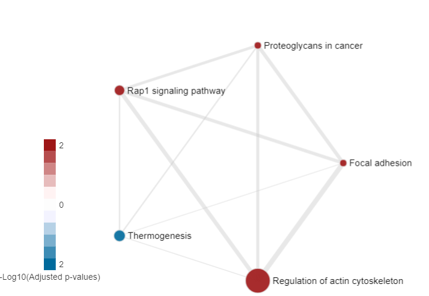

# HTSanalyzeR2  

Welcome to the homepage of **HTSanalyzeR2** package!

This package provides gene set over-representation, enrichment and network analyses for various preprocessed high-throughput data as well as corresponding time-series data including CRISPR, RNA-seq, micro-array and RNAi. It could also generate a dynamic shiny report encompassing all the results and visualizations, facilitating the users maximally for downloading, modifying the visualization parts with personal preference and sharing with others by publishing the report to [Shinyapps.io](http://shiny.rstudio.com/articles/shinyapps.html).

## Quick Installation

If you are a current bioconductor user and have `devtools` package installed, you only need to call `install_github` function in `devtools` to install `HTSanalyzeR2`. If you encountered errors, please refer to the section *Potential Dependency Issues*.  

```
# Installation requires bioconductor and devtools, please use the following commands if you've not

source("https://bioconductor.org/biocLite.R")
biocLite(c("devtools"))

# Then install HTSanalyzeR2

devtools::install_github("CityUHK-CompBio/HTSanalyzeR2", build_vignettes=TRUE, 
  repos=BiocInstaller::biocinstallRepos(),
  dependencies=TRUE, type="source")
```

## Dependency

**HTSanalyzeR2** requires the following R/Bioconductor packages for its full function:    

- GO.db 
- cellHTS2 
- Rcpp 
- foreach 
- stringr 
- igraph 
- BioNet 
- DT 
- shiny 
- shinydashboard 
- colourpicker 
- KEGGREST 
- data.table 
- htmlwidgets 
- methods 
- RankProd 
- AnnotationDbi 
- graphics 
- grDevices 
- stats 
- utils 

**HTSanalyzeR2** also suggests the following R/Bioconductor packages for improved user experience:  

- BiocStyle  
- rmarkdown  
- testthat  
- knitr  
- org.Hs.eg.db  
- doParallel  
- Biobase  


#### Potential Dependency Issues

If you are using ubuntu, common dependency issues should be solved using the following one line command:  
```
sudo apt-get install -y libssl-dev libcurl4-openssl-dev libxml2-dev libgmp-dev libmpfr-dev
```

Details about this:  

1. `devtools` need package `git2r`, which requires openssl library. Please install `libssl-dev` on Ubuntu or corresponding package on other OS.

2. `devtools` need package `httr`, which requires curl library. Please install `libcurl4-openssl-dev` on Ubuntu or corresponding package on other OS.

3. `igraph` requres xml library. Please install `libxml2-dev` on Ubuntu or corresponding package on other OS.

4. `RankProd` need package `Rmpfr`, which requires gmp and mpfr library. Please install `libgmp-dev` and `libmpfr-dev` on Ubuntu or corresponding package on other OS.


## Quick Start

Here is a simple but useful case study to use **HTSanalyzeR2** to perform gene set enrichment analysis and further visualize all the results in an interactive html report.

The only required input for **HTSanalyzeR2** is a list of interested genes with weight under a specific phenotype. For example, in the following case study, we take the output from *limma* by comparing CMS4 with non-CMS4 colon cancer samples. Details please refer to our vignette.

Before starting the demonstration, you need to load the following packages:
```
library(HTSanalyzeR2)
library(org.Hs.eg.db)
library(KEGGREST)
library(igraph)
```
Start analysis:
```
## prepare input for analysis
data(GSE33113_limma)
phenotype <- as.vector(GSE33113_limma$logFC)
names(phenotype) <- rownames(GSE33113_limma)

## specify the gene sets type you want to analyze
PW_KEGG <- KeggGeneSets(species="Hs")
ListGSC <- list(PW_KEGG=PW_KEGG)

## iniate a *GSCA* object
gsca <- GSCA(listOfGeneSetCollections=ListGSC, 
            geneList=phenotype)
            
## preprocess
gsca1 <- preprocess(gsca, species="Hs", initialIDs="SYMBOL",
                    keepMultipleMappings=TRUE, duplicateRemoverMethod="max",
                    orderAbsValue=FALSE)

## analysis
gsca2 <- analyze(gsca1, 
                 para=list(pValueCutoff=0.05, pAdjustMethod="BH",
                           nPermutations=100, minGeneSetSize=180,
                           exponent=1), 
                           doGSOA = TRUE)

## append gene sets terms
gsca3 <- appendGSTerms(gsca2, 
                       keggGSCs=c("PW_KEGG"))

## view enrichment Map
viewEnrichMap(gsca3, gscs=c("PW_KEGG"),
              allSig = FALSE, gsNameType = "term", ntop = 5)
```


```
## visualize all results in an interactive report
report(gsca3)
```

## Getting help

Should you have any questions about this package, you can either email to the developers listed in the *Description* part of this package or create an issue in the [issue part](https://github.com/CityUHK-CompBio/HTSanalyzeR2/issues).


