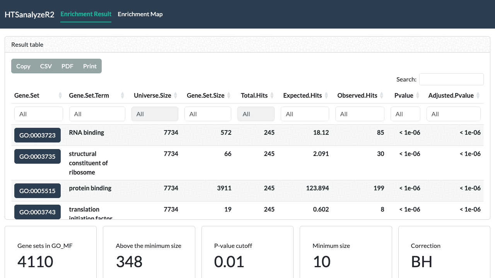
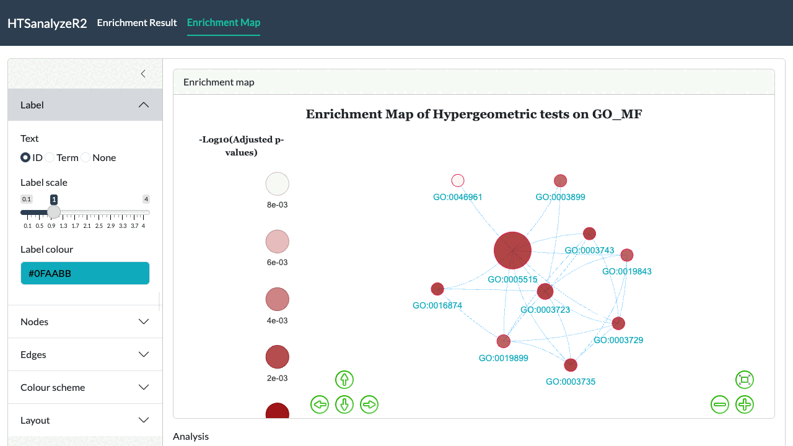
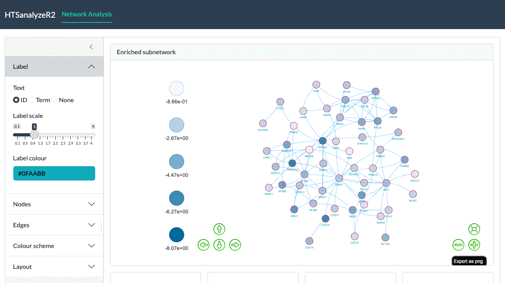
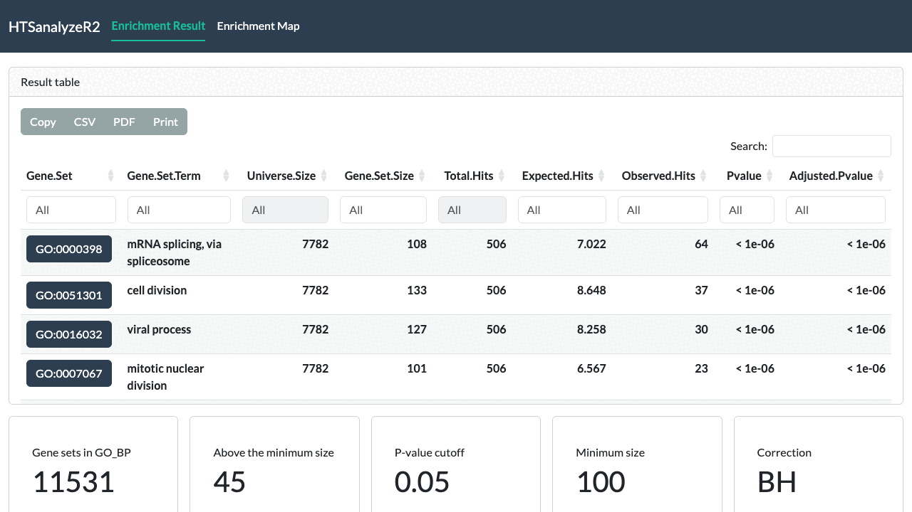
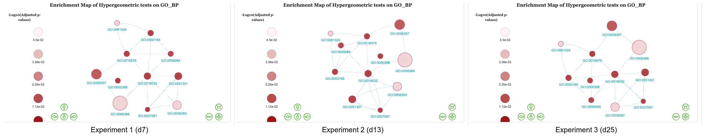
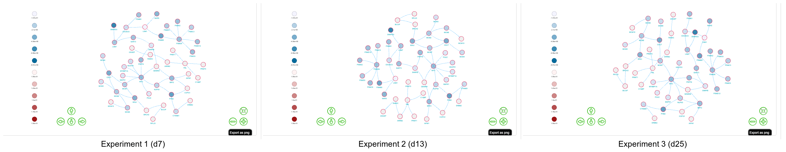

# Interactive-Shiny-report-of-HTSanalyzeR2

## Introduction

In this short tutorial, we will give a detailed illustration for the
interactive Shiny report of **HTSanalyzeR2** to visualize the results
and modify figures in different aspects.

## Interactive Shiny report visualization

### Visualize single *GSCA* object for individual data set

For single data set analysis, after performing gene set analysis by
HTSanalyzeR2, we can get a *GSCA* object and use the function *report*
to launch the Shiny report.

``` r

data(d7_gsca)
report(d7_gsca)
```

#### The GSOA result table \[Figure1\]



The GSOA result table

The above screenshot shows the GSOA result table where users can either
get a general summary of the analysis parameters, choose which analysis
and which gene set collection to show or download the result by
different format.

#### Parameters for modifying the figure \[Figure2\]

The settings live in a collapsible panel beside every graph. It has five
sections: **Label**, **Nodes**, **Edges**, **Colour scheme** and
**Layout**. Every change is applied to the rendered graph in place,
without recomputing the analysis or resetting the layout.

- **Label**: how nodes are labelled, with three parameters: *Text* (gene
  set ID, term, or none), *Label scale* and *Label colour*.
- **Nodes**: *Scale*, *Opacity*, *Border width*, *Border colour* and the
  colour used for nodes without a phenotype value.
- **Edges**: *Scale* and *Colour*.
- **Colour scheme**: the two ends of the positive and of the negative
  colour scale. The sign of the enrichment score or phenotype decides
  which scale a node uses.
- **Layout**: the node-repulsion parameters of the force-directed
  layout.
  - Mode: *Lin-Log mode* and *Strong gravity mode* change how the layout
    treats distance.
  - Parameters: *Edge repel* and *Adjust sizes* make the figure looser.
  - Gravity: ranging from -50 to 50. The larger it is, the looser the
    pattern.



The enrichment map of GSOA result

The above screenshot shows the enrichment map of a GSOA result together
with the settings panel. Hovering a node shows its identifier, term and
value; the buttons in the lower right pan, zoom, fit the view and export
the graph as PNG.

### Visualize single *NWA* object for individual data set

For single data set analysis, after performing enriched subnetwork
analysis by HTSanalyzeR2, we can get a *NWA* object and use the function
*report* to launch the Shiny report.

``` r

data(d7_nwa)
report(d7_nwa)
```

#### The identified subnetwork \[Figure3\]



The identified subnetwork

The below screenshot shows the identified subnetwork where users can
either get a general summary of the subnetwork attributes, modify the
subnetwork based on their data and preference or download the subnetwork
as PNG for further use.

### Visualize a list of *GSCA* objects for “Time-course” data

``` r

data(gscaTS)
## To make the figure more compact, we set a cutoff 
## to move any other edges with low Jaccard coefficient.
reportAll(gscaTS, cutoff = 0.03)
```

#### GSEA results table for “Time-course” data \[Figure4\]



GSEA results table for “Time-course” data

The above screenshot shows the GSOA result tables for Time-course data
with three time points where users can either get a general summary of
the analysis parameters, choose which analysis, which gene set
collection and which experiment result to show or download the result by
different format.

#### Union enrichment map for “Time-course” data \[Figure5\]



Union enrichment map for “Time-course” data

The below screenshot shows the union enrichment maps of GSEA result for
“Time-course” data with filtered edges by setting a cutoff on the edges.
The *Experiment* slider moves through the time points while the layout
is kept fixed, so the three maps can be compared directly. Here, we can
clearly see a gradual change among them.

### Visualize a list of *NWA* objects for “Time-course” data

``` r

data(nwaTS)
reportAll(nwa = nwaTS)
```

#### Union subnetwork for “Time-course” data \[Figure6\]



Union subnetwork for “Time-course” data

### Visualize both *GSCA* and *NWA* objects simultaneously

``` r

reportAll(gsca = gscaTS, nwa = nwaTS)
```

The above screenshot shows the union subnetworks for “Time-course” data.
As with the enrichment maps, the *Experiment* slider moves through the
time points while the layout stays fixed, so a gradual change among the
three union subnetworks can be seen clearly.

#### Visualize both GSEA and network result in the same report \[Figure7\]


Visualize both GSEA and network result in the same report

If you do both gene set analysis and enriched subnetwork analysis, it’s
also possible to visualize both of them in the same Shiny report as
showed here.

## Session Info

    ## R version 4.6.0 (2026-04-24)
    ## Platform: aarch64-apple-darwin23
    ## Running under: macOS Tahoe 26.5.2
    ## 
    ## Matrix products: default
    ## BLAS:   /Library/Frameworks/R.framework/Versions/4.6/Resources/lib/libRblas.0.dylib 
    ## LAPACK: /Library/Frameworks/R.framework/Versions/4.6/Resources/lib/libRlapack.dylib;  LAPACK version 3.12.1
    ## 
    ## locale:
    ## [1] C.UTF-8/C.UTF-8/C.UTF-8/C/C.UTF-8/C.UTF-8
    ## 
    ## time zone: Asia/Shanghai
    ## tzcode source: internal
    ## 
    ## attached base packages:
    ## [1] stats     graphics  grDevices utils     datasets  methods   base     
    ## 
    ## other attached packages:
    ## [1] BiocStyle_2.40.0
    ## 
    ## loaded via a namespace (and not attached):
    ##  [1] digest_0.6.39       desc_1.4.3          R6_2.6.1           
    ##  [4] bookdown_0.48       fastmap_1.2.0       xfun_0.60          
    ##  [7] cachem_1.1.0        knitr_1.51          htmltools_0.5.9    
    ## [10] rmarkdown_2.31      lifecycle_1.0.5     cli_3.6.6          
    ## [13] sass_0.4.10         pkgdown_2.2.1       textshaping_1.0.5  
    ## [16] jquerylib_0.1.4     systemfonts_1.3.2   compiler_4.6.0     
    ## [19] tools_4.6.0         ragg_1.5.2          bslib_0.10.0       
    ## [22] evaluate_1.0.5      yaml_2.3.12         BiocManager_1.30.27
    ## [25] otel_0.2.0          jsonlite_2.0.0      rlang_1.3.0        
    ## [28] fs_2.1.0            htmlwidgets_1.6.4
