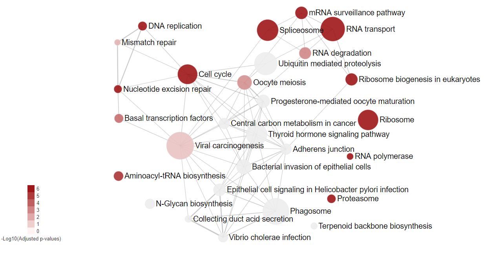
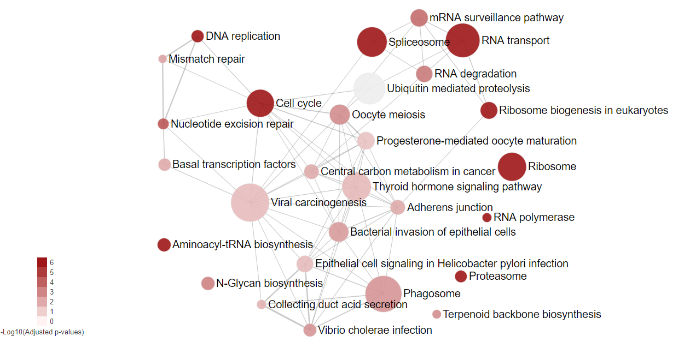

```{r setup, include=FALSE}
knitr::opts_chunk$set(echo = TRUE, eval = TRUE,
                      fig.align   = 'center',
                      fig.width   = 8,
                      fig.height = 4)
```

# An overview of HTSanalyzeR2

Diverse high-throughput technologies such as microarray, RNA-seq, RNAi and CRISPR bring a huge potential to genome-widely investigate the underlying biological mechanism with a specific phenotype, yet also cause great inconvenience for researchers to efficiently analyze such diverse data in a unified workflow. There is also no software so far claimed to be able to perform functional annotation for time-course data with interactive visualization. Here, we have implemented a versatile R package, **HTSanalyzeR2**, which has several advantages as below [Figure 1]: 

+ **HTSanalyzeR2** can perform gene set analysis and enriched subnetwork analyses for pre-processed data generated by various popular high-throughput techonologies including RNA-seq, micro-array, CRISPR, and RNAi in a unified workflow.

+ For time-course data or the same experiment coming from different research groups, **HTSanalyzeR2** can perform time series analysis and comparative analysis for better mutual comparison.

+ **HTSanalyzeR2** could generate an interactive report for users downloading, visualizing, modifying the figures as well as sharing with others.


## Supported analysis

+ Gene set over-representation analysis (GSOA): Measure the significance of overlap between user's interested genes (hits) and gene sets by hypergeometric test.
+ Gene set enrichment analysis (GSEA): Measure the concordant trend of a gene set in one phenotype.
+ Enriched subnetwork analysis: Identify subnetworks enriched for genes highly associated with the studied phenotype given a known network.
+ Time series analysis/Comparative analysis: All aboved analysis on time-course data sets with several time points or multiple data sets with the same phenotype from different groups, by which to better compare the gene functional annotation results among different time points or data sets from different groups.

## Supported input data types

+ Interested gene list
+ Named phenotypes preprocessed from either **RNA-seq**, **micro-array**, **RNAi** or **CRISPR** data
+ **'Time course' data**

## Supported ontologies/pathways

+ Gene Ontology: [GO](http://www.geneontology.org/)
    - Molecular function (MF)
    - Biological process (BP)
    - Cellular component (CC)
+ Kyoto Encyclopedia of Genes and Genomes pathways: [KEGG](http://www.genome.jp/kegg/)
+ Molecular Signatures Database: [MSigDB v6.1](http://software.broadinstitute.org/gsea/msigdb/index.jsp)
    - h: hallmark gene sets
    - c1: positional gene sets
    - c2: curated gene sets
    - c3: motif gene sets
    - c4: computational gene sets
    - c5: GO gene sets
    - c6: oncogenic signatures
    - c7: immunologic signatures
+ Customized  gene sets

## Supported species

+ Gene Ontology and KEGG gene sets support any species that have an **OrgDb** object in [Bioconductor](http://bioconductor.org/packages/release/BiocViews.html#___OrgDb).

+ MSigDB gene sets support all 8 gene set collections for **Homo Sapiens** and three gene set collections: 'c2', 'c6' and 'c7' for **Mus musculus**.

## Visualization

+ GSEA plot
+ Enrichment map
+ Enriched subnetwork
+ Interactive report

In the next parts, two simple case studies will be illustrated to demonstrate the usage of this package. Before starting the demonstration, you need to install and load the following packages:
```{r, results='hide', message=FALSE, warning=FALSE}
library(HTSanalyzeR2)
library(org.Hs.eg.db)
library(KEGGREST)
library(GO.db)
library(igraph)
library(limma)
library(TxDb.Hsapiens.UCSC.hg19.knownGene)
```

# Case study1: Single dataset analysis of gene expression data

This case study uses **HTSanalyzeR2** to perform gene set over-representation analysis (GSOA), gene set enrichment analysis (GSEA) and enriched subnetwork analyses on a common gene expression profile. Basically, this dataset is from a micro-array experiment on 90 colon cancer patients with GEO number named [GSE33113](https://www.ncbi.nlm.nih.gov/geo/query/acc.cgi?acc=GSE33113). Using the Colon Cancer Consensus Molecular Subtyping classifier generated by Guinney J et al. in 2015 (@Guinney2015), we can easily get the subtype label of each patient. Motivated by the poorest prognosis of CMS4 patients, we want to detect the enriched pathways of CMS4 patients compared to non-CMS4 patients. To this end, first we need to do the differential expression analysis using the most popular R packge 'limma' tailored for micro-array data. 

## microarray data preprocessing using 'limma' 

```{r}
data(GSE33113_exp)
data(GSE33113_label)

## delete samples with no CMS label
GSE33113_label <- GSE33113_label[which(!is.na(GSE33113_label))]
GSE33113_exp <- GSE33113_exp[, match(names(GSE33113_label),
                                     colnames(GSE33113_exp))]

## differential expression analysis using "limma" package between
## CMS4 samples and other samples
group <- rep(0, ncol(GSE33113_exp))
group[which(GSE33113_label == "CMS4")] <- 1

fit <- lmFit(GSE33113_exp, model.matrix(~ group))
fit <- eBayes(fit)
GSE33113_limma <- topTable(fit, coef=2, number=Inf, adjust.method="BH")
```

## Gene set over-representation analysis (GSOA) and gene set enrichment analysis (GSEA)
 
### Prepare the input data

To perform GSEA for single dataset, you must preprare the following inputs:

1. a named numeric vector of phenotypes (usually this would be a vector of genes with log2 fold change).
1. a list of gene set collections (could be generated by **HTSanalyzeR2** or use customized gene sets).

First you need to prepare a named phenotype.

```{r}
phenotype <- as.vector(GSE33113_limma$logFC)
names(phenotype) <- rownames(GSE33113_limma)
```

Then, if you also want to do GSOA on a list of interested genes by hypergeometric test, you need to define the 'hits' as your interested genes. For example, here we define the hits as genes with absolute log2 fold change greater than 1 and adjust *p* value less than 0.05. **In this case, the names of phenotype, namely all the input genes, would be taken as the background gene list to perform hypergeometric test.**

**Note**:In cases if you want to do GSOA with only a list of hits and no background, **HTSanalyzeR2** can also realize it. For details please go to Part5: Special usage of HTSanalyzeR2.

```{r}
## define hits if you want to do GSOA
hits <- rownames(GSE33113_limma[abs(GSE33113_limma$logFC) > 1 &
                                  GSE33113_limma$adj.P.Val < 0.05, ])
```

Then we must define the gene set collections. A gene set collection is a list of gene sets, each of  which consists of a group of genes with the same known function. **HTSanalyzeR2** provides facilities which greatly simplify the creation of up-to-date gene set collections including three Gene Ontology terms: Molecular Function (MF), Biological Process (BP), Cellular Component (CC) and KEGG pathways. Gene sets in a comprehensive molecular signatures database, [MSigDB](http://software.broadinstitute.org/gsea/msigdb)(@Arthur2011), for Homo Sapiens and Mus musculus are also provided. Here, to simplify the demonstration, we will only use one GO, KEGG and one MSigDB gene set collection. To work properly, you need to choose the right species for your input genes. Besides, these gene set collections must be provided as a named list as below:

```{r}
## generate gene set collection
GO_MF <- GOGeneSets(species="Hs", ontologies=c("MF"))
PW_KEGG <- KeggGeneSets(species="Hs")
MSig_C2 <- MSigDBGeneSets(collection = "c2", species = "Hs")

## combine all needed gene set collections into a named list for further analysis
ListGSC <- list(GO_MF=GO_MF, PW_KEGG=PW_KEGG, MSig_C2=MSig_C2)
```

### Initialize and preprocess

An S4 class named 'GSCA' is developed to perform GSOA in order to find the gene sets sharing significant overlapping with hits. Gene set enrichment analysis (GSEA), as described by Subramanian et al. (@Subramanian2005), can also be conducted simultaneously.

To initialize a new 'GSCA' object, the previous prepared phenotype and a named list of gene sets collections are needed. In addition, as said before, if you also want to do GSOA, 'hits' is needed.

```{r}
gsca <- GSCA(listOfGeneSetCollections=ListGSC,
             geneList=phenotype, hits=hits)
```

Then a preprocess step including invalid input data removing, duplication removing by different methods, initial gene identifiers converting to Entrez ID and phenotype ordering needs to be performed to fit for the next analysis. See the help documentation of funciton *preprocess* for more details.

```{r, results='hide', message=FALSE}
gsca1 <- preprocess(gsca, species="Hs", initialIDs="SYMBOL",
                    keepMultipleMappings=TRUE, duplicateRemoverMethod="max",
                    orderAbsValue=FALSE)
```

### Perform analysis

After getting a preprocessed 'GSCA' object, you can perform gene set over-representation analysis (GSOA) and gene set enrichment analysis (GSEA) using the function named *analyze*. This function needs an argument called *para*, which is a list of parameters including:

+ *pValueCutoff*: a single numeric value specifying the cutoff for adjusted pvalues considered significant.
+ *pAdjustMethod*: a single character value specifying the pvalue adjustment method.
+ *nPermutations*: a single numeric value specifying the number of permutation times for deriving p-values of GSEA.
+ *minGeneSetSize*: a single numeric value specifying the minimum number of genes shared by a gene set and the background genes, namely the phenotype. Gene sets with fewer than this number are removed from both GSOA and GSEA.
+ *exponent*: a single integer or numeric value used in weighting phenotypes in GSEA, as described by Subramanian et al. (@Subramanian2005).

```{r, results='hide', eval=FALSE}
gsca2 <- analyze(gsca1,
                 para=list(pValueCutoff=0.05, pAdjustMethod="BH",
                           nPermutations=100, minGeneSetSize=150,
                           exponent=1),
                 doGSOA = TRUE, doGSEA = TRUE)
```

In this case study, we only use 100 permutations and set a relative large *minGeneSetSize* just for a fast compilation of this vignette. In real applications, you may want a much smaller threshold (e.g. 10) and more permutation times (e.g. 10000) to get a more meaningful GSEA result.

During the enrichment analysis of gene sets, the function evaluates the statistical significance of the gene set scores by performing a large number of permutations. To analyze it more efficiently, our package allows parallel calculation based on the *doParallel* package. To do this, the user simply needs to register and claim to use multiple cores **before** running *analyze*.

```{r, results='hide', message=FALSE}
## analyze using 4 cores
if (requireNamespace("doParallel", quietly=TRUE)) {
    doParallel::registerDoParallel(cores=4)
} else {
}

gsca2 <- analyze(gsca1,
                 para=list(pValueCutoff=0.05, pAdjustMethod="BH",
                           nPermutations=100, minGeneSetSize=150,
                           exponent=1),
                 doGSOA = TRUE, doGSEA = TRUE)
```

After analyzing, all the results are stored in slot *result* and can be easily accessed using a function named *getResult*. If GSOA and GSEA are both performed, gene sets which are both significant in this two analysis based on either pvalue or adjusted pvalue can be accessed.

```{r}
## 1. GSOA result of MF gene sets from GO
head(getResult(gsca2)$HyperGeo.results$GO_MF, 3)

## 2. GSEA result of KEGG gene sets
head(getResult(gsca2)$GSEA.results$PW_KEGG, 3)

## 3. results both significant regarding to pvalues in GSOA
##    and GSEA of 'c2' gene sets from MSigDB
head(getResult(gsca2)$Sig.pvals.in.both$MSig_C2, 3)

## 4. result both significant regarding to adjust pvalues in GSOA
##    and GSEA of 'c2' gene sets from MSigDB
head(getResult(gsca2)$Sig.adj.pvals.in.both$MSig_C2, 3)
```

In addition, to make the results more understandable, users are highly recommended to annotate the gene sets ID to names by function *appendGSTerms*. As a result, an additional column named 'Gene.Set.Term' would appear.

```{r, message=FALSE}
gsca3 <- appendGSTerms(gsca2, goGSCs=c("GO_MF"),
                       keggGSCs=c("PW_KEGG"),
                       msigdbGSCs = c("MSig_C2"))

head(getResult(gsca3)$GSEA.results$PW_KEGG, 3)
```

### Summarize results

A *summarize* method could be performed to get a general summary for an analyzed 'GSCA' object including the gene set collections, genelist, hits, parameters for analysis and the summary of result.

```{r}
summarize(gsca3)
```

### Plot gene sets

To better view the GSEA result for a single gene set, you can use *viewGSEA* to plot the positions of the genes of the gene set in the ranked phenotypes and the location of the enrichment score. To this end, you must first get the gene set ID by *getTopGeneSets*, which can return all or the top significant gene sets from GSEA results.  Basically, the user needs to specify the type of results – "HyperGeo.results" or "GSEA.results", the name(s) of the gene set collection(s) as well as the type of selection– all (by parameter 'allSig') or top (by parameter 'ntop') significant gene sets.


```{r, fig.cap = "GSEA result plot of one gene set of the Molecular Function collection", fig.align="center", fig.small = TRUE}
topGS <- getTopGeneSets(gsca3, resultName="GSEA.results",
                        gscs=c("GO_MF", "PW_KEGG"), allSig=TRUE)
topGS
viewGSEA(gsca3, gscName="GO_MF", gsName=topGS[["GO_MF"]][2])  ## [Figure 2]
```


```{r, fig.cap = "GSEA result plot of one gene set of the KEGG collection",  fig.align="center", fig.small = TRUE}
viewGSEA(gsca3, gscName="PW_KEGG", gsName=topGS[["PW_KEGG"]][4])  ## [Figure 3]
```

You can also plot all or the top significant gene sets in batch and store them as png or pdf format into a specified path by using *plotGSEA*.

```{r, eval=FALSE}
plotGSEA(gsca3, gscs=c("GO_MF", "PW_KEGG"), ntop=3, filepath=".")
```

### Enrichment Map

To get a comprehensive view of the GSOA result or GSEA result instead of a list of significant gene sets with no relations, our package provides *viewEnrichMap* function to draw an enrichment map for better illustration(@Merico2010). More specifically, in the enrichment map, nodes represent significant gene sets sized by the genes it contains and the edge represents the Jaccard similarity coefficient between two gene sets. Nodes color are scaled according to the adjusted pvalues (the darker, the more significant). For GSOA, there is only one color for nodes whereas for GSEA enrichment map, the default color is setted by the sign of enrichment scores (red:+, blue:-). You can also set your favourite format by changing the parameter named 'options'.

However, users are always highly recommended to use function *report* to visualize and modify the enrichment map with personal preference in an interactive report, such as different layout, color and size of nodes, types of labels and etc. More details please go to Part4: An interactive Shiny report of results.


```{r, eval=FALSE}
## the enrichment map of GSEA result for top 8 significant 
## gene sets in both 'PW_KEGG' and 'GO_MF'
viewEnrichMap(gsca3, resultName = "GSEA.results",
              gscs=c("PW_KEGG", "GO_MF"),
              allSig = FALSE, gsNameType = "term", ntop = 8)  ## [Figure 4]
```


```{r, eval=FALSE}
## the enrichment map of GSEA result for all significant 
## gene sets in 'PW_KEGG' 
viewEnrichMap(gsca3, resultName = "GSEA.results",
              gscs=c("PW_KEGG"),
              allSig = TRUE, gsNameType = "term")   ## [Figure 5]
```


From the above enrichment maps of GSEA result, though we filter away many gene sets by a large cutoff to speed up the compilation of this vignette, we can still see that for the CMS4 CRC samples, pathways related to metabolism tend to be down-regulated and pathways related to cancer metastasis such as "Focal adhension" are significantly up-regulated, which is very consistent with what's been reported by Guinney J et al. in 2015 (@Guinney2015). Interested users are encouraged to re-run the analysis with a smaller cutoff of parameter *minGeneSetSize* (e.g. 10) and greater *nPermutations* (e.g. 10000) in *analyze* step to get a more meaningful result.

```{r, eval=FALSE}
## the enrichment map of GSOA result for
## top 8 significant gene sets in 'PW_KEGG' and 'GO_MF'
viewEnrichMap(gsca3, resultName = "HyperGeo.results",
              gscs=c("PW_KEGG", "GO_MF"),
              allSig = FALSE, gsNameType = "term", ntop = 8)  ## [Figure 6]

```


```{r, eval=FALSE}
## the enrichment map of GSOA result for
## all significant gene sets in 'PW_KEGG'
viewEnrichMap(gsca3, resultName = "HyperGeo.results",
              gscs=c("PW_KEGG"),
              allSig = TRUE, gsNameType = "term")  ## [Figure 7]
```


From the above enrichment maps of GSOA result, the trend is quite similar as in GSEA result though here we have no idea of how these pathways are regulated.

### Enrichment Map with specific gene sets

It is often the case that the enrichment map would be of large size due to a huge number of enriched gene sets. However, you may only be interested in a small part of them. A big size of enrichment map would also be in a mess and lose the information it can offer. In that way, **HTSanalyzeR2** provides an interface allowing users to draw the enrichment map on their interested gene sets. More details please see the help documentation of function *viewEnrichMap*. For example, here, we're only interested in KEGG pathways related to tumorigenesis or cancer development.

```{r, warning=FALSE, fig.height=4, fig.width=8, eval=FALSE}
## specificGeneset needs to be a subset of all analyzed gene sets
## which can be roughly gotten by:
tmp <- getTopGeneSets(gsca3, resultName = "GSEA.results", gscs=c("PW_KEGG"),
                      ntop = 200, allSig = FALSE)

## In that case, we can define specificGeneset such as below:
PW_KEGG_geneset <- tmp$PW_KEGG[c(1:2, 5, 8:10, 13, 15, 17:21,
                                 23)]

## the name of specificGenesets also needs to match with the names of tmp
specificGeneset <- list("PW_KEGG"=PW_KEGG_geneset)
viewEnrichMap(gsca3, resultName = "GSEA.results", gscs=c("PW_KEGG"),
              allSig = FALSE, gsNameType = "term",
              ntop = NULL, specificGeneset = specificGeneset)  ## [Figure 8]
```


## Enriched subnetwork analysis

You can also perform subnetwork analysis (@Beisser2010, @Dittrich2008) to extract the subnetwork enriched with genes which are highly associated with the phenotype given a known network using **HTSanalyzeR2**.  Networks can come from different sources, especially protein interaction networks are often used. They can either be fetched by our package to download specific species PPI network from BioGRID database or defined by users.

### Prepare input, initialize and preprocess

An S4 class named 'NWA' is developed to perform subnetwork analysis. To initiate an 'NWA' object, you need to prepare a named numeric vector called 'pvalues'. If phenotypes for genes are also available, they can be inputted in the initialization step and used to highlight nodes with different colors in the identified subnetwork. In that case, the nodes are colored by the sign of phenotypes (red:+, blue:-).

When creating a new object of class 'NWA', the user also has the possibility to specify the parameter 'interactome' which should be an object of class 'igraph'. If it is not available, the interactome can also be set up later.

```{r}
pvalues <- GSE33113_limma$adj.P.Val
names(pvalues) <- rownames(GSE33113_limma)
nwa <- NWA(pvalues=pvalues, phenotypes=phenotype)
```

The next step is to preprocess the inputs. Similar to 'GSCA' class, the function *preprocess* can conduct invalid input data removing, duplication removing by different methods and initial gene identifiers converting to Entrez ID.

```{r, results='hide', message=FALSE}
nwa1 <- preprocess(nwa, species="Hs", initialIDs="SYMBOL",
                   keepMultipleMappings=TRUE, duplicateRemoverMethod="max")
```

Then, you need to create an interactome for the network analysis using method *interactome* if you have not inputted your own interactome in the initial step. To this end, you can either specify the species and fetch the corresponding network from BioGRID database, or input an interaction matrix if it is in right format: a matrix with a row for each interaction, and at least contains the three columns “InteractorA”, “InteractorB” and “InteractionType”, where the interactors are specified by Entrez ID. For more details please see *help(interactome)*.

Here, we just use *interactome* to download an interactome from BioGRID, which would meet user's requirements in most cases.

```{r, message=FALSE}
nwa2 <- interactome(nwa1, species="Hs", genetic=FALSE)
getInteractome(nwa2)
```

### Perform analysis and view the identified subnetwork

Having preprocessed the input data and created the interactome, the subnetwork analysis could be performed by using the *analyze* method. This function will plot a figure showing the fitting of the BioNet model to your distribution of pvalues (@Beisser2010), which is a good way to check the choice of statistics used in this function. The argument *fdr* of the method *analyze* is the false discovery rate for BioNet to fit the beta-uniform mixture (BUM) model. The parameters of the fitted model will then be used for the scoring function, which subsequently enables the BioNet package to search the optimal scoring subnetwork. See BioNet for more details (@Beisser2010).

Here, to simplify this vignette, we set a very strict 'fdr' as 1e-06. In practice, you may want to set a less strict one (e.g. 0.01).

```{r, results='hide', message=FALSE, warning=FALSE, eval=TRUE, fig.cap = "Fitting BUM model to p-values by BioNet", fig.width=10, fig.height=6, fig.align="center"}
nwa3 <- analyze(nwa2, fdr=1e-06, species="Hs")  ## [Figure 9]
```

Similar to 'GSCA', you can also view the subnetwork by *viewSubNet*. Again, for better visualization, modification and downloading, users are highly recommended to view the result in an interactive Shiny report by function *report*.

```{r, eval=FALSE}
viewSubNet(nwa3)   ## [Figure 10]
```


From the above subnetwrok, we can see under a relative strict cutoff with fdr=1e-06, an enriched subnetwork with 81 genes is identified. Among them, two hub genes: TRIM25 and APP, have been both reported to be associated with cancer progression and metastasis. There are also other  8 genes related to cancer epithelial-to-mesenchymal transition (EMT) in the subnetwork: "CDH2", "COL8A2", "CTGF", "EGFR", "FGFR1", "WWTR1", "CYR61" and "DDR2". All of these may indicate the identified subnetwork has a strong association with the phenotype we studied - CMS4 specific subnetwork. Thus, by the subnetwork analysis which map the phenotype data to a given network, researchers can narrow down the genes which are highly associated with the phenotype they studied with network information such as protein-protein physical interaction.

### Summarize results

Like 'GSCA', the method *summarize* could also be used to get a general summary of an analyzed 'NWA' object including inputs, interactome, parameters for analysis and the size of identified subnetwork.

```{r, eval=TRUE}
summarize(nwa3)
```

# Case study2: Time series analysis of time-course CRISPR data

This case study uses a time-course CRISPR genome-wide drop-out data as a demonstration to perform time series analysis. Data 'd7', 'd13' and 'd25' are three gRNA sequencing data after transducting an improved CRISPR system into a human cancer cellline on day 7, day 13 and day 25 separately (@Tzelepis2016), in order to check the efficiency of the improved CRISPR system. Data are further preprocessed by [MAGeCK](https://sourceforge.net/p/mageck/wiki/Home/) to identify significant essential genes from genome-scale CRISPR knockout screens. Here, to simplify and speed up the compilation of this vignette, we start from the results gotten by MAGeCK and randomly extract part of the MAGeCK result as a demonstration, which may not have the true biological meaning. Users are encouraged to use their own true biological data to explore this function.

## Gene set over-representation analysis (GSOA) and gene set enrichment analysis (GSEA)

### Prepare the input data

To perform gene sets analysis for time-course data, one must prepare the following inputs:

1. A character matrix contains experiment information with each experiment in row and descriptions in column. Specifically, it should at least contain two columns named as 'ID' and 'Description'.
1. A list of phenotypes data, each element of this list is a phenotype data of that experiment (usually a phenotype data would be a vector of genes with log2 fold change). **An important thing here needs to be noted is the order of each element of this list must match the order of 'ID' in the experiment information matrix**.
1. A list of gene set collections which can either be gotten by **HTSanalyzeR2** or defined by users using customized gene sets.

To make it easy to compile this vignette, here we only use KEGG pathways to make a demonstration.

```{r}
data(d7, d13, d25)
expInfor <- matrix(c("d7", "d13", "d25"), nrow = 3, ncol = 2, byrow = FALSE,
                   dimnames = list(NULL, c("ID", "Description")))
datalist <- list(d7, d13, d25)

phenotypeTS <- lapply(datalist, function(x) {
  tmp <- as.vector(x$neg.lfc)
  names(tmp) <- x$id
  tmp
})

PW_KEGG <- KeggGeneSets(species="Hs")
ListGSC <- list(PW_KEGG=PW_KEGG)
```

Similar as single dataset analysis, if you also want to do GSOA, a list of hits is needed. Here, each element of this list is a hits of that experiment. Also, **the order of each element of this list must match the order of 'ID' in the experiment information matrix**. Here, for each data set, we define genes with *pvalue* less than 0.01 as hits.

```{r}
hitsTS <- lapply(datalist, function(x){
  tmp <- x[x$neg.p.value < 0.01, "id"]
  tmp
})
```

### Initialize and preprocess

To perform GSEA and GSOA for time-course data, an S4 class 'GSCABatch' which can pack the time-course data to do further analysis is developed. First, you need to create a new 'GSCABatch' object using the prepared inputs.

```{r}
gscaTS <- GSCABatch(expInfor = expInfor,
              phenotypeTS = phenotypeTS, listOfGeneSetCollections = ListGSC,
              hitsTS = hitsTS)
```

Then, the 'GSCABatch' object need to be preprocessed using *preprocessGscaTS* method. The preprocess procedure here is the same as single data set. This step would return a list of preprocessed 'GSCA' object.

```{r, results='hide', message=FALSE}
gscaTS1 <- preprocessGscaTS(gscaTS, species="Hs", initialIDs="SYMBOL",
                            keepMultipleMappings=TRUE,
                            duplicateRemoverMethod="max",
                            orderAbsValue=FALSE)
```

### Perform analysis

After getting a list of preprocessed 'GSCA' object, you can use *analyzeGscaTS* to perform GSOA as well as GSEA on it. The parameters' function here is the same as in single data set. Similarly, to speed up you can use multiple cores via *doParallel* package. This step would return a list of analyzed 'GSCA' object.

```{r, results='hide', message=FALSE}
## analyze using 4 cores
if (requireNamespace("doParallel", quietly=TRUE)) {
    doParallel::registerDoParallel(cores=4)
} else {
}

gscaTS2 <- analyzeGscaTS(gscaTS1, para=list(pValueCutoff=0.05,
                                            pAdjustMethod="BH",
                                            nPermutations=1000,
                                            minGeneSetSize=10,
                                            exponent=1),
                         doGSOA = TRUE, doGSEA = TRUE)
```

```{r, message=FALSE}
## GSEA result of the first experiment
head(getResult(gscaTS2[[1]])$GSEA.results$PW_KEGG, 3)
```

To make the result more understandable, users are highly recommended to annotate the gene sets ID to names by function *appendGSTermsTS*. As a result, an additional column named 'Gene.Set.Term' would appear.

'gscaTS3' will return a list of analyzed 'GSOA' objects, you can easily get the results of each 'GSOA' object as in single data set analysis.

```{r, message=FALSE}
gscaTS3 <- appendGSTermsTS(gscaTS2, keggGSCs=c("PW_KEGG"))
head(getResult(gscaTS3[[1]])$GSEA.results$PW_KEGG, 3)

## 'gscaTS3' is a list of analyzed 'GSOA' objects
gscaTS3
```

You can then use *reportAll* to generate an interactive Shiny report to visualize a union enrichment map for the time-course data. To put it more specific, a union enrichment map is generated by taking the union of significant gene sets in each experiment  and then form an enrichment map as illustrated before. Thus, there maybe be some gene sets not significant in one time point but in others with the same layout, by which users can be easier to compare the enrichment results among different time points. More details please see Part4: An interactive Shiny report of results.

## Enriched subnetwork analysis

### Prepare input, initialize and preprocess
An S4 class named 'NWABatch' is developed to pack time-course data for further subnetwork analysis. You need first to create a new object of class 'NWABatch'. To this end, a list of pvalues is needed. Each element of this list is a vector of pvalues of that experiment. **Again, an important thing needs to be noted is the order of each element of this list must match the order of 'ID' in the experiment information matrix**. If a list of phenotypes is also available, they can be inputted during the initialization stage and used to highlight nodes with different colors in the identified subnetwork. Also, the order of each element of this phenotypes list must match the order of 'ID' in the experiment information matrix.

```{r}
pvalueTS <- lapply(datalist, function(x){
  tmp <- as.vector(x$neg.p.value)
  names(tmp) <- x$id
  tmp
})

## generate a new 'NWABatch' object for further analysis
nwaTS <- NWABatch(expInfor = expInfor,
             pvalueTS = pvalueTS, phenotypeTS = phenotypeTS)
```

After creating an object of 'NWABatch', a preprocessing step needs to be performed which will return a list of preprocessed 'NWA' objects.

```{r, results='hide', message=FALSE, eval=FALSE}
nwaTS1 <- preprocessNwaTS(nwaTS, species="Hs", initialIDs="SYMBOL",
                          keepMultipleMappings=TRUE,
                          duplicateRemoverMethod="max")
```

### Perform analysis

Similarly, an interactome needs to be created before performing subnetwork analysis using *interactomeNwaTS* if you have not inputted your own interactome in the initial step. You can either specify the species and fetch the corresponding network from BioGRID database, or input an interaction matrix if it is in right format. More details please see *help(interactomeNwaTS)*.

Then, *analyzeNwaTS* could perform the subnetwork analysis for a list of 'NWA' object, which would take a few minutes. Finally, this step would return a list of analyzed 'NWA' objects.
```{r, results='hide', message=FALSE, eval=FALSE}
nwaTS2 <- interactomeNwaTS(nwaTS1, species="Hs",
                           reportDir="HTSanalyzerReport", genetic=FALSE)
nwaTS3 <- analyzeNwaTS(nwaTS2, fdr=0.0001, species="Hs")
```

```{r, eval=FALSE}
## get a general summary for the first experiment
summarize(nwaTS3[[1]])
```

You can then use *reportAll* to generate an interactive Shiny report to visualize a union subnetwork for this time-course data. To put it more specific, a union subnetwork is generated by taking the union of identified subnetwork in each experiment. Thus, there maybe be some genes not identified in the subnetwork of one time point but in others with the same layout. More details please see Part4: An interactive Shiny report of results.

# An interactive Shiny report

To better visualize all the results, our package could generate an interactive Shiny report containing all the results in: gene set analysis (GSEA and GSOA) table using specific ontologies or pathways; enrichment map for GSEA or GSOA result; enriched subnetwork, etc. All of the visualization can be modified by users in a lot of aspects in the interactive report, such as the whole layout, nodes' and edges' attributes, color scheme and etc. All of the result tables and the modified figures can then be downloaded in different formats.

## Shiny report for single data set

For single data set result such as 'gsca3' and 'nwa3' generated by the above analysis, you can either use *report* or *reportAll* as below to launch the interactive report:

```{r, eval = FALSE}
## 1. generate an interactive shiny report for 'GSCA' object using report
report(gsca=gsca3)

## 2. generate an interactive shiny report for 'NWA' object using report
report(nwa=nwa3)

## 3. generate an interactive shiny report for 'GSCA' object using reportAll
reportAll(gsca=gsca3)
```

You can even visualize both 'GSCA' and 'NWA' object with *reportAll* function. Particularly, to better visualize the enrichmentmap, you can filter away edges with small Jaccard coefficient by setting parameter 'cutoff'.
```{r, eval=FALSE}
reportAll(gsca=gsca3, nwa=nwa3, cutoff = 0.05)  ## [Figure 11-13]
```


In the interactive report, for GSOA and GSEA results of single data set, you can download the table of different gene set collection in different format such as 'csv' or 'pdf'. On the right of this interface, there is the summary information about this analysis. For the dynamic enrichment map, you can change the layout, set node size and color, label types, edge thickness and download it as 'svg' format. For subnetwork analysis result, you can also change the above mentioned items to fit your requirements.

## Shiny report for time-course data sets

For time-course data, you should use *reportAll* to generate the report. In addition, you can reset the order of time-course data for visualization by setting the argument 'TSOrder'.

```{r, eval = FALSE}
## 1. generate an interactive shiny report for
##    a list of 'GSCA' objects using reportAll
reportAll(gsca=gscaTS3)

## 2. generate an interactive shiny report for
##    a list of 'NWA' objects using reportAll
reportAll(nwa=nwaTS3)

## 3. generate an interactive shiny report for a list of
##    'GSCA' objects by customized order using reportAll
reportAll(gsca=gscaTS3, TSOrder=names(gscaTS3)[c(3, 1, 2)])
```

Intriguingly, for time-course data result, you can see a dynamic change for each 'time point' in either the union enrichment map or the union subnetwork with the same layout, which could give you a general view about the difference among each time point. For example, here, we take screenshots of the union enrichment map of GSOA results of 'gscaTS3' among three time points, from which we can clearly see the GSOA difference among them.

```{r, eval = FALSE}
reportAll(gsca=gscaTS3) ## [Figure 14-16]
```







Besides, similar with single data set analysis, you can also visualize the enrichment map of specific genesets for time-course data by specifying the argument 'specificGeneset' in *reportAll*.

```{r, eval = FALSE}
## As told previously, specificGeneset needs to be a subset of all
## analyzed gene sets which can be roughly gotten by:
tmp <- getTopGeneSets(gscaTS3[[1]], resultName = "GSEA.results",
                      gscs=c("PW_KEGG"), ntop = 200, allSig = FALSE)

## In that case, we can define specificGeneset as below:
PW_KEGG_geneset <- tmp$PW_KEGG[c(1:5,10:12,14:40)]

## the name of specificGenesets also needs to match with the names of tmp
specificGeneset <- list("PW_KEGG"=PW_KEGG_geneset)
reportAll(gsca=gscaTS3, specificGeneset=specificGeneset)
```


After calling *report* or *reportAll*, it would automaticlly generate a directory with names starting with "GSCAReport", "NWAReport" or "AnalysisReport" which includes the result named as "results.RData" and an R script named as "app.R". "results.RData" contains the analyzed *GSCA* and *NWA* object (if any) as well as two other additional parameters needed in report lauching, which can be re-loaded into R using **readRDS** function. In addition, by opening "app.R" in RStudio, users can publish and share the report with others via [Shinyapps.io](http://www.shinyapps.io/), details please go to [Shinyapps.io](http://www.shinyapps.io/).

# Special usage of HTSanalyzeR2

## Gene set over-representation analysis (GSOA) with no background

In case if you only have a list of genes and want to do GSOA to measure the significance of overlapping with gene sets having known functions, **HTSanalyzeR2** provides an interface to realize it. Since phenotype is only used as background genes in GSOA, you can manually set all the genes of that species as phenotype and give them a pseudo value to fit **HTSanalyzeR2** as below:

```{r, eval=FALSE}
data(d7)
hits1 <- d7$id[1:200]

## set all the coding genes of Homo sapiens as phenotype
allgenes <- keys(TxDb.Hsapiens.UCSC.hg19.knownGene, keytype = "GENEID")
## change Entrez ID to gene name to keep consistent with hits
allgenes <- mapIds(org.Hs.eg.db, keys = allgenes,
                   keytype = "ENTREZID", column = "SYMBOL")

## give phenotype a pseudo value to fit for HTSanalyzeR2
phenotype <- rep(1, length(allgenes))
names(phenotype) <- allgenes
```

Then, you can use the artificial phenotype as gene background and your hits to perform GSOA.
```{r, eval=FALSE}
gsca <- GSCA(listOfGeneSetCollections=ListGSC,
            geneList=phenotype, hits=hits1)
## the following analysis is the same as before
```

## Customized  gene sets

When you have your own gene sets with specific functions and they do not belong to any GO terms, KEGG or MSigDB, you can set your customized gene set collection and follow the format of GO, KEGG and MSigDB gene set collections. An important thing here you need pay attention to is the ID of genes in the gene set collection must be Entrez ID.

```{r, eval=FALSE}
## Suppose your own gene sets is geneset1 and geneset2
allgenes <- keys(org.Hs.eg.db, "ENTREZID")
geneset1 <- allgenes[sample(length(allgenes), 100)]
geneset2 <- allgenes[sample(length(allgenes), 60)]

## Set your custom gene set collection and make the format to fit HTSanalyzeR2
CustomGS <- list("geneset1" = geneset1, "geneset2" = geneset2)

## then the gene set collections would be as below:
ListGSC <- list(CustomGS=CustomGS)
## other part is the same as before
```

## An interface to 'fgsea' package

HTSanalyzeR2 also provides an interface to [fgsea]((https://bioconductor.org/packages/release/bioc/html/fgsea.html)) package which proposes a novel algorithm for fast preranked gene set enrichment analysis using cumulative statistic calculation. Details please see [fgsea](https://www.biorxiv.org/content/early/2016/06/20/060012) (@Sergushichev2016).

To perform GSEA by **fgsea** instead of HTSanlayzeR2, users need to specifiy the parameter *GSEA.by* in *analyze* (for single data set) or *analyzeGscaTS* (for time series analysis) with *fgsea*. Otherwise, it will use **HTSanalyzeR2** by default.

```{r, eval=FALSE}
gsca4 <- analyze(gsca1,
                 para=list(pValueCutoff=0.05, pAdjustMethod="BH",
                           nPermutations=100, minGeneSetSize=150,
                           exponent=1),
                 doGSOA = TRUE, doGSEA = TRUE,
                 GSEA.by = "fgsea")
```

## Extract shared genes between enriched pathways and input gene list

Once you've finished the GSEA or GSOA, you may be interested in some pathways and wonder which genes are shared by that pathway and you input gene list.

```{r}
## Suppose you are interested in "growth factor activity" in 'Molecular Function',
## of Gene Ontology, We can retrieve the GO ID of this pathway:
GO_MFrslt <- getResult(gsca3)$HyperGeo.results$GO_MF
GOID <- rownames(GO_MFrslt[GO_MFrslt$Gene.Set.Term
                           == "growth factor activity", ])

## Then get the genes in this pathways
pathway_gene <- GO_MF[[GOID]]

## change Entrez ID to gene symbol
pathway_gene <- mapIds(org.Hs.eg.db, keys = pathway_gene,
                       keytype = "ENTREZID", column = "SYMBOL")

## get the shared genes between this pathway and your input gene list
intersect(pathway_gene, hits)
```

# A pipeline function for common phenotype data

For common phenotype data, we provide a pipeline function *HTSanalyzeR2Pipe* to perform a comprehensive analysis including gene set analysis and subnetwork analysis. Finally, it will return a list of *GSCA* object and *NWA* object.

```{r, eval=FALSE}
data4enrich <- as.vector(d7$neg.lfc)
names(data4enrich) <- d7$id
hits <-  names(data4enrich[which(abs(data4enrich) > 2)])
ListGSC = list(GO_MF=GO_MF, PW_KEGG=PW_KEGG)
rslt <- HTSanalyzeR2Pipe(data4enrich = data4enrich,
                         hits = hits,
                         doGSOA = TRUE,
                         doGSEA = TRUE,
                         listOfGeneSetCollections = ListGSC,
                         species = "Hs",
                         initialIDs = "SYMBOL",
                         pValueCutoff = 0.05,
                         nPermutations = 1000,
                         cores = 2,
                         minGeneSetSize = 15,
                         keggGSCs=c("PW_KEGG"),
                         goGSCs = c("GO_MF"),
                         doNWA = FALSE)
report(rslt$gsca)
```


# A pipeline function for CRISPR data pre-processed by MAGeCK

For the CRISPR data pre-processed by MAGeCK, we also provide a pipeline function to do a comprehensive analysis including gene set analysis and subnetwork analysis, which would be seamless linked with MAGeCK and provides great convenience to the users. Finally, it would automaticlly generate a dynamic shiny report containing all the results.

```{r, eval=FALSE}
ListGSC = list(GO_MF=GO_MF, PW_KEGG=PW_KEGG)
HTSanalyzeR4MAGeCK(MAGeCKdata = d7,
                   selectDirection = "negative",
                   doGSOA = FALSE,
                   doGSEA = TRUE,
                   listOfGeneSetCollections = ListGSC,
                   species = "Hs",
                   initialIDs = "SYMBOL",
                   pValueCutoff = 0.05,
                   pAdjustMethod = "BH",
                   nPermutations = 100,
                   minGeneSetSize = 100,
                   exponent = 1,
                   keggGSCs=c("PW_KEGG"),
                   goGSCs = c("GO_MF"),
                   msigdbGSCs = NULL,
                   doNWA = TRUE,
                   reportDir = "HTSanalyzerReport",
                   nwAnalysisGenetic = FALSE,
                   nwAnalysisFdr = 0.001)
```

# Session Info

```{r, echo=FALSE}
sessionInfo()
```

# References
