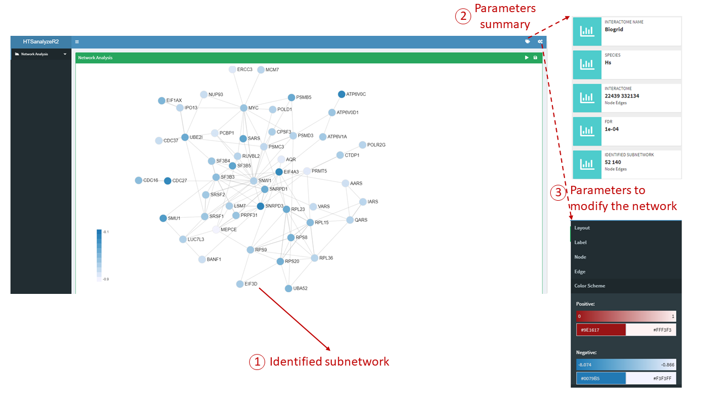

```{r setup, include=FALSE}
knitr::opts_chunk$set(echo = TRUE)
```

# Introduction

In this short tutorial, we will give a detailed illustration for the interactive Shiny report of **HTSanalyzeR2** to visualize the results and modify figures in different aspects.

# Interactive Shiny report visualization

## Visualize single *GSCA* object for individual data set

For single data set analysis, after performing gene set analysis by HTSanalyzeR2, we can get a *GSCA* object and use the function *report* to launch the Shiny report. 

```{r, eval=FALSE}
data(d7_gsca)
report(d7_gsca)
```


### The GSOA result table [Figure1]


The above screenshot shows the GSOA result table where users can either get a general summary of the analysis parameters, choose which analysis and which gene set collection to show or download the result by different format.

### Parameters for modifying the figure [Figure2]

There are five main parts for users to modify their figure by interactive operations including:**Layout**, **Label**, **Node**, **Edge** and **Color Scheme**. Following is a detailed explanation for each part.

+ **Layout**: A widge to control the whole pattern
     + Mode: There are two layout modes inside this Shiny report, users can choose any of them to get better visualization based on their data.
     + Parameters: Two more parameters *Egde Repel* and *Adjust Sizes* could be used to make the figure looser.
     + Gravity: Ranging from -50 to 50, users can adjust it step by step. The larger it is, the looser the pattern would be.
+ **Label**: A widge to modify the label of nodes with three easy-to-understand parameters: *Text*, *Label Scale* and *Label color*.
+ **Node**: A widge to modify the nodes with four parameters: *Scale*, *Opacity*, *Border Width* and *Border Color*.
+ **Edge**: A widge to modify the edges with two parameters: *Edge Scale* and *Edge Color*.
+ **Color Scheme**: A widge to change the default color.


The above screenshot shows the enrichment map of GSOA result. Users can click the topright button to modify the figure based on their data and preference. 

## Visualize single *NWA* object for individual data set

For single data set analysis, after performing enriched subnetwork analysis by HTSanalyzeR2, we can get a *NWA* object and use the function *report* to launch the Shiny report.

```{r, eval=FALSE}
data(d7_nwa)
report(d7_nwa)
```

### The identified subnetwork [Figure3]


The below screenshot shows the identified subnetwork where users can either get a general
summary of the subnetwork attributes, modify the subnetwork based on their data and preference or download the subnetwork in svg format for further use.

## Visualize a list of *GSCA* objects for "Time-course" data
```{r, eval=FALSE}
data(gscaTS)
## To make the figure more compact, we set a cutoff 
## to move any other edges with low Jaccard coefficient.
reportAll(gscaTS, cutoff = 0.03)
```

### GSEA results table for "Time-course" data [Figure4]


The above screenshot shows the GSOA result tables for Time-course data with three time points where users can either get a general summary of the analysis parameters, choose which analysis, which gene set collection and which experiment result to show or download the result by different format.

### Union enrichment map for "Time-course" data [Figure5]


The below screenshot shows the union enrichment maps of GSEA result for "Time-course" data with filtered edges by setting a cutoff on the edges. Users can click the topright button to modify the figure based on their data and preference. Here, we can clearly see a gradual change among three union enrichment maps with the same layout.

## Visualize a list of *NWA* objects for "Time-course" data
```{r, eval=FALSE}
data(nwaTS)
reportAll(nwa = nwaTS)
```

### Union subnetwork for "Time-course" data [Figure6]


## Visualize both *GSCA* and *NWA* objects simultaneously
```{r, eval=FALSE}
reportAll(gsca = gscaTS, nwa = nwaTS)
```

The above screenshot shows the union subnetworks for "Time-course" data. Users can click the topright button to modify the figure based on their data and preference. We can clearly see a gradual change among three union subnetworks with the same layout.

### Visualize both GSEA and network result in the same report [Figure7]


If you do both gene set analysis and enriched subnetwork analysis, it's also possible to visualize both of them in the same Shiny report as showed here.

# Session Info

```{r, echo=FALSE}
sessionInfo()
```
