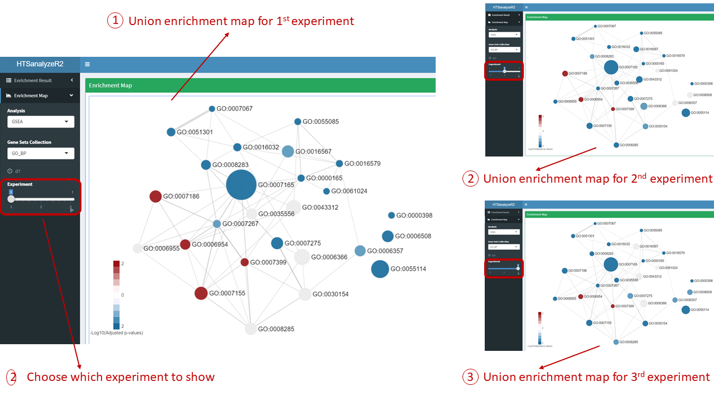
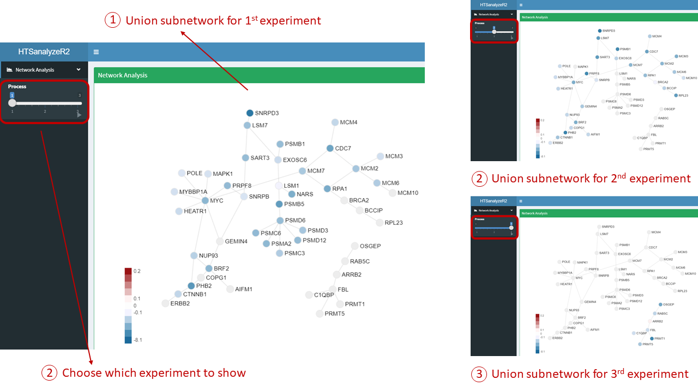
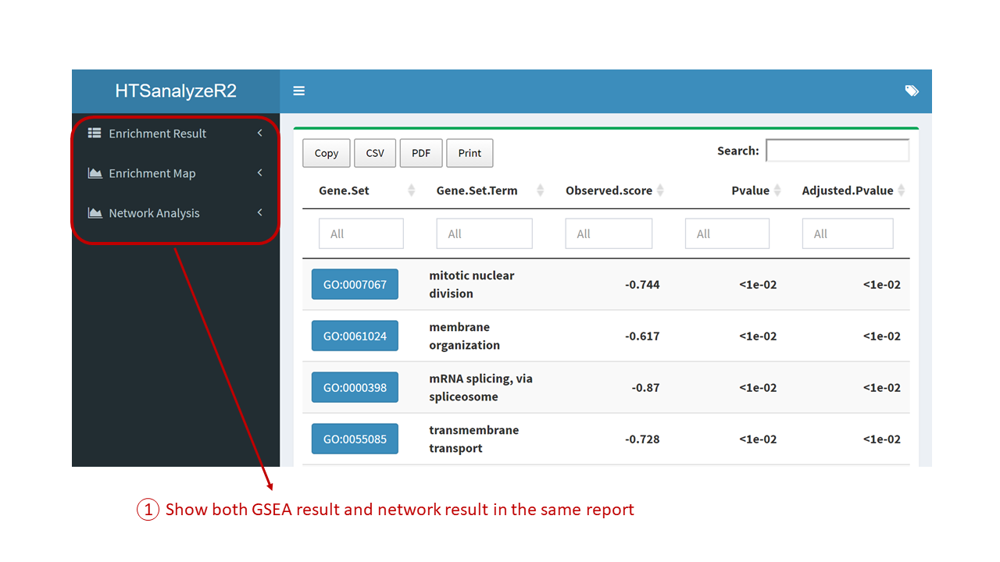

```{r setup, include=FALSE}
knitr::opts_chunk$set(echo = TRUE)
```

# Introduction

In this short tutorial, we give a detailed illustration for the shiny report part of **HTSanalyzeR2** to visualize the results and modify figures in different aspects.

# Interactive Shiny report visualization

## Visualize single *GSCA* object for individual data set

For single data set analysis, after analyzed by HTSanalyzeR2, we can get a *GSCA* object and use the function *report* to launch the shiny report. 
```{r, eval=FALSE}
data(d7_gsca)
report(d7_gsca)
```


### The hypergeometric test result table [Figure1]


### Parameters for modifying the figure [Figure2]

There are five main parts for users to modify their figure by interactive operations including:**Layout**, **Label**, **Node**, **Edge** and **Color Scheme**. Following is a detailed explanation for each part.

+ **Layout**: A widge to control the whole pattern
     + Mode: There are two layout modes inside this Shiny report, users can choose any of them to get better visualization based on their data.
     + Parameters: Two more parameters *Egde Repel* and *Adjust Sizes* could be used to make the figure looser.
     + Gravity: Ranging from -50 to 50, users can adjust it step by step. The larger it is, the more even the pattern would be.
+ **Label**: A widge to modify the label of nodes with three easy-to-understand parameters: *Text*, *Label Scale* and *Label color*.
+ **Node**: A widge to modify the nodes with four easy-to-understand parameters: *Scale*, *Opacity*, *Border Width* and *Border Color*.
+ **Edge**: A widge to modify the edges with two easy-to-understand parameters: *Edge Scale* and *Edge Color*.
+ **Color Scheme**: A widge to change the default color.


## Visualize single *NWA* object for individual data set
```{r, eval=FALSE}
data(d7_nwa)
report(d7_nwa)
```

### The identified subnetwork [Figure3]


## Visualize a list of *GSCA* objects for time series/comparative analysis
```{r, eval=FALSE}
data(gscaTS)
## To make the figure more compact, we set a cutoff 
## to move any other edges with low Jaccard coefficient.
reportAll(gscaTS, cutoff = 0.035)
```

### GSEA results table for time series/comparative analysis [Figure4]


### Union enrichment map for time series/comparative analysis [Figure5]



## Visualize a list of *NWA* objects for time series/comparative analysis
```{r, eval=FALSE}
data(nwaTS)
reportAll(nwaTS)
```

### Union subnetwork for time series/comparative analysis [Figure6]



## Visualize both *GSCA* and *NWA* objects simultaneously
```{r, eval=FALSE}
reportAll(gsca = gscaTS, nwa = nwaTS)

```

### Visualize both GSEA and netwrok result in the same report [Figure7]


# Session Info

```{r, echo=FALSE}
sessionInfo()
```
